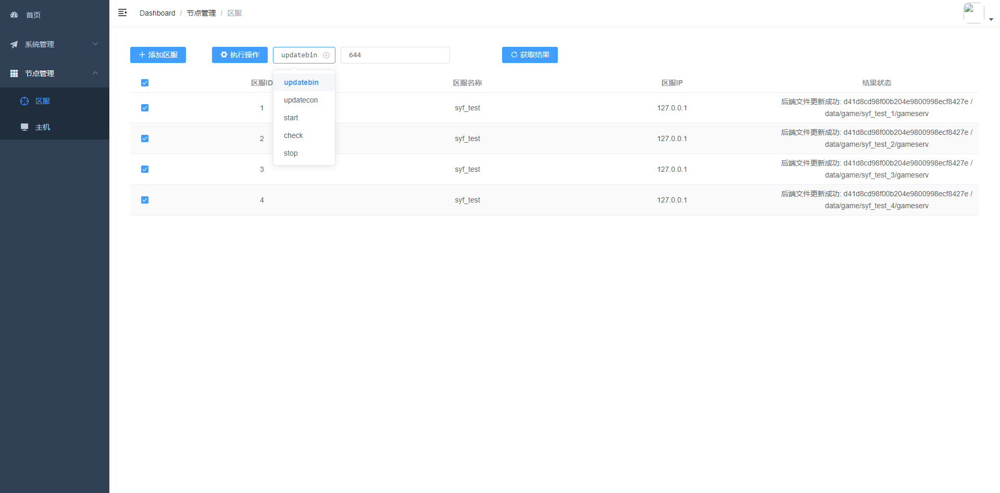

### opsmanager

* *说明*
```
  - 只公开部分代码
  - 此代码提供一个自动化运维部署的大概思路
```

* *描述*
```
  - opsmanager是一个server&client架构的运维工具
  - opsmaster负责处理web请求
  - opsservant负责提供远程过程调用
  - 技术栈: fastapi + celery + grpc + vue-admin-template
```



* *部署*
```
  - 直接部署:
    - 前端打包后使用nginx进行部署
    - 检查主机上是否安装opsmaster和opsservant项目下pyproject.toml文件中所对应的python版本
    - 主机上安装python的pdm包管理工具
    - 将opsmaster和opsservant项目分别上传到运维主机和游戏主机上
    - 使用pdm分别将opsmaster和opsservant所需要的依赖包进行更新: pdm update
    - 分别配置opsmaster.conf和opsservant.conf配置文件
    - 分别在opsmaster和opsservant项目下启动: pdm run python main.py
```

  <!-- - docker部署
    - 运维主机和游戏主机安装docker服务
    - 将opsmaster和opsservant项目上传到运维主机和游戏主机
    - 分别在opsmaster和opsservant目录下进行对应的镜像构建: 
      - docker build -t pro-opsmaster .
      - docker build -t pro-opsservant .
    - 分别在运维主机和游戏主机上根据pro-opsmaster和pro-opsservant镜像启动对应的容器:
      - docker run --name opsmaster --rm -p 8888:8888 -itd pro-opsmaster
      - docker run --name opsservant --rm -p 8887:8887 -v /data/game:/data/game -itd pro-opsservant
  -->
